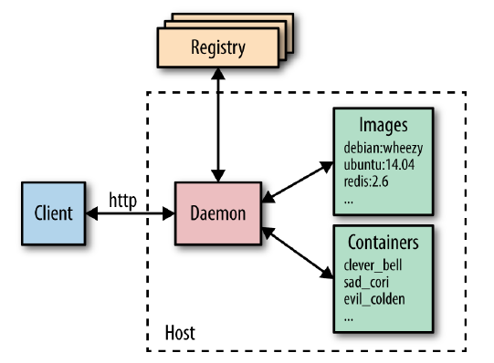

title: Conteneurs Docker
class: animation-fade
layout: true

<!-- This slide will serve as the base layout for all your slides -->
<!--
.bottom-bar[
  {{title}}
]
-->

---

class: impact

# {{title}}
## *Modularisez et maîtrisez vos applications*

---

class: impact

#Bonjour à tous !

---

# À propos de vous

- Quels sont vos besoins ?

---

# À propos de moi

.center[

## Elie Gavoty

]
.col-4[
Développeur Backend, DevOps
.col-1[ ]
.col-10[

.col-1[ ]
]]

.col-4[.center[
Doctorant en philosophie de la technique

]]

.col-4[.center[
Formateur: Développement et Technologies DevOps

]]

---

# Un peu de logistique

- Les slides de présentation sont disponibles au fur et à mesure à l'adresse [https://eliegavoty.fr/documents]
--

- Les TPs sont accessibles à l'adresse [https://eliegavoty.fr/devops]
--

- Pour exporter les TPs utilisez la fonction d'impression pdf de google chrome.

---

class: impact

# Introduction

---

# Des conteneurs

.col-6[.center[]]
.col-5[

- La métaphore docker : "box it, ship it"
--

- Une abstraction qui ouvre de nouvelles possibilités pour la manipulation logicielle.
- Permet de standardiser et de contrôler la livraison et le déploiement.

]

---

# Retour sur les technologies de virtualisation

On compare souvent les conteneur aux machines virtuelles

.col-8[.center[]]
.col-4[
- **VM** : une abstraction complète pour simuler des machines

- => un processeur, mémoire, appels systèmes, réseau, virtuels (etc.)

- **conteneur** : un découpage dans linux pour séparer des ressources.
]

---

# Origine : LXC (LinuX Containers)

- Originellement Docker était basé sur le projet **lxc**.
--

- Les conteneurs sont un vieux concept qui se rapproche de `chroot`, présent dans les systèmes unix depuis longtemps : "comme tout est fichier, changer la racine c'est comme changer de système".
--

- `jail` introduit par FreeBSD pour compléter chroot en isolant les processus (pour des raisons de sécurité)
--

- En 2005 Google commence le développement des **cgroups** : une façon de tagger les demandes de processeur et les appels systèmes pour pour les grouper et les isoler.

- En 2008 démarre le projet LXC qui chercher à rassembler, les **cgroups**, le **chroot** et les **namespaces**
--

- **namespaces**: une façon de compartimenter la mémoire et le systeme de fichier

---

# Origine : LXC (LinuX Containers)

- En 2013: docker Commence à proposer une meilleure finition et une interface simple qui facilite l'utilisation des conteneurs **lxc**. Puis propose aussi son cloud **Docker hub** pour faciliter la gestion e
--

- Au fur et à mesure Docker abandonne le code de **lxc** (mais continue d'utiliser les **cgroups** et **namespaces**)
--

- Le code de base par Docker (**runC**) est néanmoins open source : il s'agit autour de l'**Open Container Initiative** de mutualiser le travail spécifique pour qui soit solide et spécifique.

---

# Bénéfices par rapport aux machines virtuelles

Docker permet de faire des "quasi machines" avec des performances proches du natif. 

- Vitesse d'exécution.
- Flexibilité sur les ressources (mémoire partagée).
- Moins **complexe** que la virtualisation
- Plus **standard** que les multiples hyperviseurs
- notamment => Moins de bugs d'interaction entre l'hyperviseur et le noyau
- Pas besoin de spécialiste

---

# Bénéfices par rapport aux machines virtuelles
VM et conteneurs proposent une flexibilité de manipulation des ressources de calculs mais les machines virtuelles était trop lourdes pour être multipliées librement :
- elle n'ont pas pu être utilisées pour isoler **chaque application**
- elles ne permettent pas la transformation profonde que permettent les conteneurs :
  - le passage à une architecture **microservices**
  - et donc la **scalabilité horizontale** à l'heure du cloud

---

# Pourquoi utiliser Docker ?

Docker est pensé dès le départ pour faire des conteneurs applicatifs:

- **Isoler** les modules applicatifs.
--

- Gérer les **dépendances** en les embarquants dans le conteneur.
--

- **Immutabilité**.
--

- **Cycle de vie court** -> pas de persistance (DevOps).

---

# Pourquoi utiliser Docker ?

Docker transforme littéralement la **"logistique"** applicative.

- **Uniformisation** face aux divers langages de programmation
--

- **Installation sans accrocs** donc **automatisation** beaucoup plus facile.
--

- Permet de démocratiser l'**intégration continue** et la **livraison continue** voire le **d*éploiement continu**.
--

- **Rapprocher les développeurs** des **opérations** (tout le monde a la même technologie).
  
- Adoption plus large de la philosophie DevOps.

---

# Positionnement sur le marché

- Docker est la technologie ultra-dominante sur le marché de la conteneurisation
  - La simplicité d'usage et le travail de standardisation (OCI) lui on donné légitimité et fiabilité
  - La métaphore du conteneur de transport et la bonne documentation on 
--

- **LXC** existe toujours et avec **LXD** il est devenu très agréable à utiliser.
- Il a cependant un positionnement différent = faire des conteneurs pour faire tourner un OS linux complet. 
--

- **RKT**: un autre container engine développé par **container linux** avec une architecture un peu différente. permet de faire tourner des images docker
--

- **Apache Mesos**: Un logiciel de gestion de cluster qui permet de se passer de docker mais finalement propose un support pour docker et rkt depuis 2016.

---

# Terminologie et concepts fondamentaux

Ne pas confondre :

- Une **image** : un modèle pour créer un conteneur.
- Un **conteneur** : l'instance qui tourne sur la machine.
- Un **volume** : un espace virtuel pour gérer le stockage d'un conteneur et le partage entre conteneurs.

Autres concepts centraux:

- un **registry**: un serveur ou stocker des artefacts docker c'est à dire des images versionnées.
- un **orchestrateur**: un outil qui gère automatiquement le cycle de vie des conteneurs (création/suppression).

---

# Visualiser l'architecture Docker

## Daemon - Client - images - registry

---

# L'écosystème Docker

- **Docker Compose** : Un outil pour décrire des applications multiconteneurs.
--

- **Docker Machine** : Un outil pour gérer des hôtes de déploiement docker
--

- **Docker Hub** : Le service d'hébergement universel d'images proposé par Docker Inc. (le registry officiel)
--

- (Docker **cloud** et Docker **store** ont fusionné avec **Docker Hub**)

---

# Docker **community** ou **entreprise**

Choisir une édition :

- **Community Edition** (Docker CE)
  - Version de référence la plus répendue.
  - Solide et déployée en production.
  - Peu de limitations, suffit pour quel qu'usage que ce soit.
  - Open Source => potentielle vérification et corrections de bugs par la communauté.

---

- **Enterprise Edition** (Docker EE)
  - Version basée sur la version community
  - Mais un version entreprise du Docker Engine
  - Une stack complète de plugins avec des fonctionnalité spécifique de:
    - Sécurité : principal argument mis en avant (contrôle des images, communication chiffrées, gestion des secrets intégrée, réseau sécurisé Kubernetes)
    - Un pannel d'outils pour une intégration plus facile de la CI/CD et des opérations agiles.
  - Et bien sur du support.
  - Intéressant pour avoir une pile bien intégrée, sécurisée pour des entreprises qui veulent leur plateforme de conteneurs on premise.

---